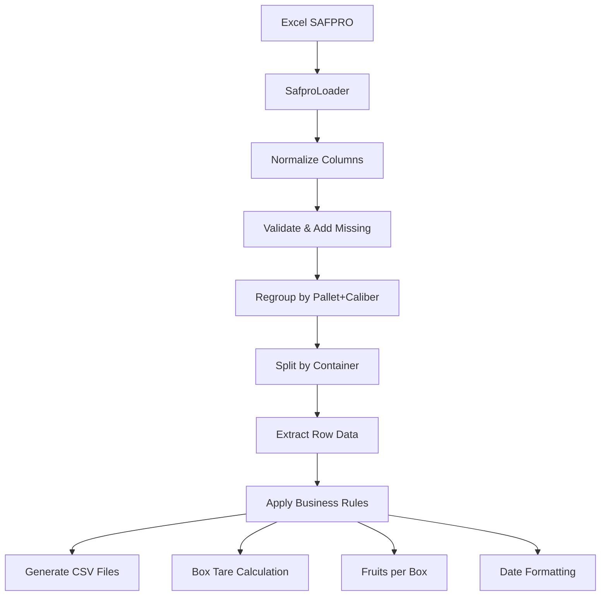

# 📦 PLManager Backend - Documentation Technique Complète

**Version:** 1.0.0  
**Framework:** FastAPI (Python 3.9)  
**Base de données:** Stockage fichiers local  
**Architecture:** Modulaire par fournisseur

---

## 📋 Table des matières

- [Vue d'ensemble](#vue-densemble)
- [Architecture générale](#architecture-générale)
- [Installation et démarrage](#installation-et-démarrage)
- [Structure du projet](#structure-du-projet)
- [API REST - root_app.py](#api-rest---root_apppy)
- [Modèles de données](#modèles-de-données)
- [Utilitaires génériques](#utilitaires-génériques)
- [Architecture des services fournisseurs](#architecture-des-services-fournisseurs)
- [Étude de cas : Service SAFPRO](#étude-de-cas--service-safpro)
- [Workflow complet](#workflow-complet)
- [Gestion des erreurs](#gestion-des-erreurs)
- [Extension et maintenance](#extension-et-maintenance)
- [Exemples d'utilisation](#exemples-dutilisation)

---

## 🎯 Vue d'ensemble

PLManager Backend est une application **FastAPI** conçue pour automatiser la conversion des **Packing Lists fournisseurs (Excel)** en **fichiers CSV normalisés** exploitables par les équipes logistiques.

### 🎭 Caractéristiques principales
- **Architecture modulaire** : un service dédié par fournisseur
- **Support multi-fournisseurs** : 25+ fournisseurs intégrés
- **Pipeline de traitement** standardisé mais configurable
- **Stockage local** : archives et exports organisés par dossiers
- **Configuration dynamique** : paramètres CSV injectés via API
- **Règles métier** spécialisées par espèce et fournisseur

### 🏢 Fournisseurs supportés
**Afrique du Sud :** SAFPRO, Komati, Grosa, Sunny, ZestFruit, Mahela, Langplaas  
**Pérou :** Athos, Athos V2, Asica, Laran, Camposol, Agualima, Viru, Avaleza  
**Équateur :** Jaguacy, Mountain Avocado  
**Kenya :** Sasini, Mavuno, Jorie, Kakuzi  
**Maroc :** ALG  
**Autres :** CPF, Unifruitti (Mosqueta, Pirona, Hefei), Angon, HNP, Swellen, Shalimar, Ingophase

---

## 🏗️ Architecture générale

### Principes de conception
1. **Modularité** : chaque fournisseur = un service indépendant
2. **Pipeline standardisé** : Load → Validate → Map → Calculate → Export
3. **Responsabilité unique** : séparation claire des couches
4. **Extensibilité** : ajout simple de nouveaux fournisseurs

### Flux de données
```
Excel Fournisseur → API Upload → Service Fournisseur → CSV Normalisé
                ↓
            Archives/          → Utils (CSV Manager, File Handler)
```

### Technologies utilisées
- **FastAPI** - Framework REST moderne
- **Pandas** - Manipulation des données Excel/CSV
- **Pydantic** - Validation des modèles de données
- **Python 3.9** - Langage principal
- **Docker** - Containerisation pour le déploiement

---

## 🚀 Installation et démarrage

### Prérequis
- Python 3.9+
- pip ou conda
- Docker (optionnel)

### Installation locale
```bash
# Cloner le projet
git clone <repository-url>
cd PLManager_backend

# Installer les dépendances
pip install -r requirements.txt

# Lancer l'application
uvicorn app.main:app --reload --host 0.0.0.0 --port 8000
```

### Installation Docker
```bash
# Build de l'image
docker build -t plmanager-backend .

# Lancement du conteneur
docker run -d -p 8000:8000 plmanager-backend
```

### Vérification
- **API Documentation:** `http://localhost:8000/docs`
- **Health Check:** `http://localhost:8000/api/health-check`
- **Redoc:** `http://localhost:8000/redoc`

---

## 📁 Structure du projet

```
PLManager_backend/
│
├── app/
│   ├── main.py                     # Point d'entrée FastAPI
│   ├── routers/
│   │   ├── root_app.py            # Routes principales
│   │   └── health_check.py        # Health check endpoint
│   ├── services/                   # Services par fournisseur
│   │   ├── safpro/                # Service SAFPRO (exemple détaillé)
│   │   ├── sunny/                 # Service Sunny
│   │   ├── komati/                # Service Komati
│   │   ├── [25+ autres...]        # Autres fournisseurs
│   ├── utils/                      # Utilitaires génériques
│   │   ├── csv_manager.py         # Gestion écriture CSV
│   │   ├── file_handler.py        # Gestion fichiers temporaires
│   │   └── [fournisseur]/         # Utils spécifiques par fournisseur
│   └── models/
│       └── request_models.py       # Modèles Pydantic
├── requirements.txt                # Dépendances Python
├── Dockerfile                      # Configuration Docker
└── README.md                      # Documentation projet
```

---

## 🌐 API REST - root_app.py

### Vue d'ensemble
Le fichier `root_app.py` centralise toutes les routes de l'API et orchestre les appels aux services fournisseurs.

### Configuration des fournisseurs
```python
FOURNISSEURS_SUPPORTES = {
    "Komati": SFAService,
    "Sunny": SunnyService,
    "Safpro": SafproService,
    "ALG": AlgService,
    "Athos": AthosService,
    # ... 25+ fournisseurs
}
```

### Endpoints principaux

#### 1. Gestion des paramètres CSV
```http
POST /api/csv-settings/
Content-Type: application/json

{
  "country_of_origin": "ZA",
  "forwarder": "DHL",
  "importer": "GH",
  "archive": "Yes"
}
```

```http
GET /api/csv-settings/
```

**Stockage :** Les paramètres sont conservés en mémoire dans `csv_settings_store`.

#### 2. Traitement des fichiers
```http
POST /api/archives-file/{fournisseur}/
Content-Type: multipart/form-data
```

**Workflow interne :**
1. Vérification fournisseur supporté
2. Sauvegarde fichier en `archives/{filename}`
3. Instanciation du service fournisseur
4. Injection des `csv_settings` si disponibles
5. Génération UUID unique `extraction_id`
6. Appel `service.process_file(file_path, output_dir)`
7. Stockage mapping `{extraction_id: [files]}`

#### 3. Récupération des résultats
```http
GET /api/get-extraction-files/{extraction_id}
```
Retourne la liste des fichiers générés (chemins relatifs).

```http
GET /api/get-csv/{extraction_id}
```
Retourne la liste brute des CSV générés (chemins complets).

```http
GET /api/download-csv/?file_path=xxx
```
Télécharge un CSV spécifique avec protection sécurisée :
- Empêche les chemins relatifs (`..`)
- Vérifie l'existence du fichier
- Corrige les doubles préfixes `outputs/`

#### 4. Mise à jour des CSV
```http
PUT /api/update-csv/
Content-Type: multipart/form-data
```

**Paramètres :**
- `file` : nouveau fichier CSV
- `csv_path` : chemin du CSV à remplacer

**Sécurités :**
- Vérification que `csv_path` est dans `outputs/`
- Validation du contenu CSV non-vide
- Recharge post-écriture pour validation

---

## 📊 Modèles de données

### CSVSettings (Pydantic)
```python
class CSVSettings(BaseModel):
    country_of_origin: str    # Pays d'origine (obligatoire)
    forwarder: str           # Transitaire (obligatoire)
    importer: str            # Importateur (obligatoire)
    archive: str             # Archivage (Oui/Non)
```

### UploadFileRequest
```python
class UploadFileRequest(BaseModel):
    fournisseur: str         # Code fournisseur
    file_path: str          # Chemin du fichier uploadé
    output_dir: str         # Répertoire de sortie
```

### Structure des données internes
**Stockage en mémoire :**
- `csv_settings_store` : Paramètres CSV globaux
- `extraction_records` : Mapping extraction_id → fichiers générés

---

## 🛠️ Utilitaires génériques

### csv_manager.py
**Responsabilité :** Écriture standardisée des fichiers CSV

```python
class CSVManager:
    @staticmethod
    def write_csv(file_path, data):
        """
        Écrit les données dans un fichier CSV.
        - Séparateur : point-virgule (;)
        - Encodage : UTF-8 with BOM (utf-8-sig)
        - Headers automatiques
        """
```

**Caractéristiques :**
- Création automatique des répertoires parents
- Validation des données non-vides
- Format standard : `;` séparateur, UTF-8-sig
- Headers automatiquement générés depuis les clés du premier dict

### file_handler.py
**Responsabilité :** Gestion des fichiers temporaires

```python
UPLOAD_DIR = "Archives/"

def save_temp_file(uploaded_file):
    """
    Sauvegarde un fichier temporaire dans 'Archives'.
    Retourne le chemin complet du fichier sauvegardé.
    """
```

**Fonctionnalités :**
- Création automatique du dossier `Archives/`
- Sauvegarde sécurisée avec nom original
- Gestion des erreurs d'écriture

---

## 🏭 Architecture des services fournisseurs

### Pattern générique
Chaque service fournisseur suit une architecture standardisée :

```
ServiceFournisseur/
├── fournisseur_service.py          # Service principal
├── fournisseur_base.py             # Pipeline générique
└── utils/fournisseur/              # Utilitaires spécialisés
    ├── fournisseur_loader.py       # Chargement Excel
    ├── fournisseur_df_manager.py   # Manipulation DataFrame
    ├── fournisseur_container_manager.py  # Gestion conteneurs
    └── fournisseur_calculations.py # Règles métier
```

### Interface commune
```python
class BaseFournisseurService:
    def __init__(self, pl_column_mapping):
        """Initialise avec le mapping colonnes Excel → CSV"""
        
    def process_file(self, file_path, output_dir):
        """Pipeline principal : retourne liste des CSV générés"""
        
    def apply_csv_settings(self, settings):
        """Applique les paramètres du front-end"""
```

### Pipeline standardisé
1. **Load** : Chargement du fichier Excel
2. **Normalize** : Normalisation des noms de colonnes
3. **Validate** : Validation des colonnes requises
4. **Complete** : Ajout des colonnes manquantes
5. **Transform** : Regroupements et transformations
6. **Split** : Découpage par conteneur
7. **Extract** : Extraction ligne par ligne
8. **Calculate** : Application des règles métier
9. **Export** : Génération des CSV finaux

---

## 🔍 Étude de cas : Service SAFPRO

### Vue d'ensemble
Le service SAFPRO illustre parfaitement l'architecture modulaire de PLManager. Il gère les Packing Lists du fournisseur sud-africain SAFPRO avec des règles métier spécifiques.

### Architecture SAFPRO

```
services/safpro/
├── safpro_service.py               # Service principal
├── safpro_base.py                  # Pipeline générique
└── utils/safpro/                   # Utilitaires spécialisés
    ├── safpro_loader.py           # Chargement Excel
    ├── safpro_df_manager.py       # Manipulation DataFrame
    ├── safpro_container_manager.py # Gestion conteneurs
    └── safpro_calculations.py     # Règles métier
```

### 1. safpro_service.py - Service principal

**Responsabilités :**
- Mapping colonnes Excel → CSV
- Application des paramètres front-end
- Extraction et formatage des données
- Gestion des règles métier spécialisées

```python
class SafproService(BaseSafproService):
    def _initialize_column_mapping(self):
        """Mapping Excel → CSV pour SAFPRO"""
        return {
            "Pallet no": ["Pallet n°"],
            "Exporter Name": ["Exporter name"],
            "Container No": ["Container n°"],
            "Species": ["Commodity"],
            "Variety": ["Variety"],
            "Size_caliber_count": ["Size/caliber/count"],
            # ... 50+ mappings
        }
    
    def apply_csv_settings(self, settings):
        """Validation et application des paramètres"""
        mandatory_fields = ["country_of_origin", "forwarder"]
        for field in mandatory_fields:
            if field not in settings:
                raise ValueError(f"Champ obligatoire manquant: {field}")
```

**Extraction des données :**
```python
def _extract_row_data(self, row):
    """Extraction ligne par ligne avec règles métier"""
    record = {}
    
    for csv_field, excel_columns in self.pl_column_mapping.items():
        # Priorité aux overrides front-end
        if csv_field in self.csv_settings:
            record[csv_field] = self.csv_settings[csv_field]
        else:
            value = self._get_field_value(row, excel_columns)
            
            # Règles métier spécialisées
            if csv_field == "Box tare (kg)":
                record[csv_field] = SafproCalculations.box_tare(...)
            elif csv_field == "Nb of fruits per box":
                record[csv_field] = SafproCalculations.nb_of_fruits_per_box(...)
            elif csv_field in date_fields:
                record[csv_field] = self._process_date_field(...)
            else:
                record[csv_field] = value
```

### 2. safpro_base.py - Pipeline générique

**Template Method Pattern :**
```python
class BaseSafproService:
    def process_file(self, file_path, output_dir):
        """Pipeline principal"""
        # 1. Préparation DataFrame
        dataframe = self._prepare_dataframe(file_path)
        
        # 2. Groupage conteneurs
        containers = self._group_containers(dataframe)
        
        # 3. Traitement par conteneur
        generated_files = []
        for index, container in enumerate(containers, start=1):
            container_df = self._filter_container(dataframe, container)
            output_path = self._process_container(container_df, output_dir, index)
            if output_path:
                generated_files.append(output_path)
                
        return generated_files
```

### 3. safpro_loader.py - Chargement Excel

**Gestion multi-format :**
```python
class SafproLoader:
    @staticmethod
    def load_excel_file(file_path, sheet_name="Data", header=0):
        """Charge Excel avec détection automatique du format"""
        if file_path.endswith(".xlsx"):
            engine = "openpyxl"
        elif file_path.endswith(".xls"):
            engine = "xlrd"
        else:
            raise ValueError("Format non supporté")
            
        return pd.read_excel(file_path, sheet_name=sheet_name, 
                           header=header, engine=engine)
```

### 4. safpro_df_manager.py - Manipulation DataFrame

**Normalisation et regroupements :**
```python
class SafproDataframeManager:
    @staticmethod
    def normalize_columns(dataframe):
        """Supprime les espaces des noms de colonnes"""
        dataframe.columns = dataframe.columns.str.strip()
    
    @staticmethod
    def regroup_by_pallet_and_caliber(df):
        """Regroupe par pallet + calibre avec agrégations"""
        # Conversion des colonnes numériques
        sum_cols = ["Net weight per pallet (kg)", "Cartons"]
        for col in sum_cols:
            df[col] = df[col].str.replace(",", ".").astype(float)
        
        # Agrégation
        grouped_df = df.groupby(["Pallet n°", "Size/caliber/count"]).agg({
            col: "sum" if col in sum_cols else "first" 
            for col in df.columns
        })
        
        # Calcul Nb of pallets
        total = grouped_df.groupby("Pallet n°")["Cartons"].transform("sum")
        grouped_df["Nb of pallets"] = grouped_df["Cartons"] / total
        
        return grouped_df
```

### 5. safpro_container_manager.py - Gestion conteneurs

```python
class SafproContainerManager:
    @staticmethod
    def group_by_container(df, container_column="Container n°"):
        """Retourne la liste des conteneurs uniques"""
        if container_column not in df.columns:
            raise ValueError(f"Colonne '{container_column}' introuvable")
        return df[container_column].dropna().unique()
    
    @staticmethod
    def filter_by_container(df, container_column, container):
        """Filtre le DataFrame pour un conteneur"""
        return df[df[container_column] == container]
```

### 6. safpro_calculations.py - Règles métier

**Règles spécialisées SAFPRO :**
```python
class SafproCalculations:
    @staticmethod
    def nb_of_fruits_per_box(caliber, species="", net_weight_per_box=None):
        """Calcul fruits/boîte avec règle SC spéciale"""
        if species == "SC" and 9.0 <= net_weight_per_box <= 11.0:
            # Mapping spécial pour Small Citrus
            mapping = {
                "1": 94, "1X": 75, "1XX": 68,
                "1XXX": 43, "2": 98, "3": 105
            }
            return mapping.get(caliber.upper(), caliber)
        return caliber
    
    @staticmethod
    def box_tare(cartons_per_pallet, species="", net_weight_per_box=None, original_value=None):
        """Calcul tare avec règle SC spéciale"""
        if species == "SC" and 9.0 <= net_weight_per_box <= 11.0:
            return 0.5  # Tare fixe pour Small Citrus
        return original_value  # Conserve valeur Excel
```

### Workflow SAFPRO détaillé



---

## 🔄 Workflow complet

### 1. Configuration initiale
```bash
# 1. Définir les paramètres CSV
POST /api/csv-settings/
{
  "country_of_origin": "ZA",
  "forwarder": "DHL", 
  "importer": "GH",
  "archive": "Yes"
}
```

### 2. Upload et traitement
```bash
# 2. Upload fichier fournisseur
POST /api/archives-file/Safpro/
Content-Type: multipart/form-data
file: SAFPRO_PL.xlsx
```

**Traitement interne :**
1. Sauvegarde en `archives/SAFPRO_PL.xlsx`
2. Instanciation `SafproService()`
3. Injection des `csv_settings`
4. Génération `extraction_id` unique
5. Appel `safpro.process_file()`
6. Retour liste des CSV générés

### 3. Récupération des résultats
```bash
# 3. Lister les fichiers générés
GET /api/get-extraction-files/{extraction_id}

# 4. Télécharger un CSV
GET /api/download-csv/?file_path=Safpro/PL_REF123_1.csv
```

### 4. Structure des exports
```
outputs/
├── Safpro/
│   ├── PL_GHS25094_1.csv
│   └── PL_GHS25095_1.csv
├── Komati/
│   └── PL_KOM001_1.csv
└── Sunny/
    └── PL_SUN789_1.csv
```

---

## ❌ Gestion des erreurs

### Types d'erreurs

#### 1. Erreurs de validation
```python
# Fournisseur non supporté
if fournisseur not in FOURNISSEURS_SUPPORTES:
    raise HTTPException(status_code=400, 
                       detail=f"Fournisseur '{fournisseur}' non pris en charge")

# Paramètres CSV manquants
mandatory_fields = ["country_of_origin", "forwarder"]
for field in mandatory_fields:
    if field not in settings:
        raise ValueError(f"Champ obligatoire manquant: {field}")
```

#### 2. Erreurs de fichiers
```python
# Fichier Excel invalide
if not os.path.exists(file_path):
    raise FileNotFoundError(f"Fichier inexistant: {file_path}")

# Format non supporté
if not file_path.endswith(('.xlsx', '.xls')):
    raise ValueError("Format non supporté. Utilisez .xlsx ou .xls")
```

#### 3. Erreurs de données
```python
# Colonnes manquantes critiques
for col in ["Pallet n°", "Size/caliber/count"]:
    if col not in df.columns:
        raise ValueError(f"Colonne manquante: {col}")

# Données vides
if not extracted_data:
    print("⚠️ Aucune donnée à écrire.")
    return None
```

### Logging et monitoring
```python
# Logs structurés
print(f"✅ Fichiers générés: {generated_files}")
print(f"📌 Paramètres CSV reçus: {settings}")
print(f"⚠️ Erreur conversion date: {e}")
print(f"❌ Erreur critique: {error}")
```

---

## 🔧 Extension et maintenance

### Ajouter un nouveau fournisseur

#### 1. Créer la structure
```bash
mkdir app/services/nouveau_fournisseur/
mkdir app/utils/nouveau_fournisseur/
```

#### 2. Implémenter le service
```python
# app/services/nouveau_fournisseur/nouveau_fournisseur_service.py
class NouveauFournisseurService(BaseNouveauFournisseurService):
    def _initialize_column_mapping(self):
        return {
            "Pallet no": ["Pallet ID"],
            "Container No": ["Container Number"],
            # ... mappings spécifiques
        }
    
    def apply_csv_settings(self, settings):
        # Validation et application des paramètres
        pass
```

#### 3. Enregistrer dans root_app.py
```python
FOURNISSEURS_SUPPORTES = {
    # ... fournisseurs existants
    "NouveauFournisseur": NouveauFournisseurService,
}
```

### Ajouter une nouvelle règle métier

```python
# app/utils/fournisseur/fournisseur_calculations.py
class FournisseurCalculations:
    @staticmethod
    def nouvelle_regle(param1, param2, param3=None):
        """Nouvelle règle métier spécialisée"""
        try:
            # Logique de calcul
            result = complex_calculation(param1, param2)
            return result
        except Exception as e:
            print(f"⚠️ Erreur nouvelle_regle: {e}")
            return default_value
```

### Optimisations possibles

#### 1. Base de données
```python
# Remplacer le stockage en mémoire par une DB
from sqlalchemy import create_engine
from sqlalchemy.orm import sessionmaker

# Tables: extractions, csv_settings, logs
```

#### 2. Cache des mappings
```python
# Cache des mappings fournisseurs
from functools import lru_cache

@lru_cache(maxsize=50)
def get_supplier_mapping(supplier_code):
    return load_mapping_from_yaml(supplier_code)
```

#### 3. Processing asynchrone
```python
# Traitement en arrière-plan pour gros fichiers
from celery import Celery

@celery.task
def process_file_async(file_path, supplier, settings):
    # Traitement long en async
    pass
```

---

## 📝 Exemples d'utilisation

### Exemple complet cURL

```bash
# 1. Configuration des paramètres CSV
curl -X POST "http://localhost:8000/api/csv-settings/" \
  -H "Content-Type: application/json" \
  -d '{
    "country_of_origin": "ZA",
    "forwarder": "DHL",
    "importer": "GH", 
    "archive": "Yes"
  }'

# Réponse: {"message": "Paramètres enregistrés avec succès"}

# 2. Upload fichier SAFPRO
curl -X POST "http://localhost:8000/api/archives-file/Safpro/" \
  -F "file=@SAFPRO_PL_GHS25094.xlsx"

# Réponse:
# {
#   "extraction_id": "abc123-def456-ghi789",
#   "message": "Fichier traité avec succès", 
#   "generated_files": ["Safpro/PL_GHS25094_1.csv"]
# }

# 3. Récupération des fichiers générés
curl -X GET "http://localhost:8000/api/get-extraction-files/abc123-def456-ghi789"

# Réponse: ["Safpro/PL_GHS25094_1.csv"]

# 4. Téléchargement du CSV
curl -X GET "http://localhost:8000/api/download-csv/?file_path=Safpro/PL_GHS25094_1.csv" \
  -o "PL_GHS25094_1.csv"

# 5. Mise à jour du CSV (optionnel)
curl -X PUT "http://localhost:8000/api/update-csv/" \
  -F "file=@PL_GHS25094_1_modified.csv" \
  -F "csv_path=Safpro/PL_GHS25094_1.csv"
```

### Exemple Python
```python
import requests
import json

# Configuration
base_url = "http://localhost:8000/api"

# 1. Définir les paramètres CSV
settings = {
    "country_of_origin": "ZA",
    "forwarder": "DHL",
    "importer": "GH",
    "archive": "Yes"
}

response = requests.post(f"{base_url}/csv-settings/", json=settings)
print(f"Settings: {response.json()}")

# 2. Upload fichier
files = {"file": open("SAFPRO_PL.xlsx", "rb")}
response = requests.post(f"{base_url}/archives-file/Safpro/", files=files)
result = response.json()

extraction_id = result["extraction_id"]
generated_files = result["generated_files"]

print(f"Extraction ID: {extraction_id}")
print(f"Generated files: {generated_files}")

# 3. Télécharger les CSV générés
for file_path in generated_files:
    response = requests.get(f"{base_url}/download-csv/", 
                          params={"file_path": file_path})
    
    with open(f"downloaded_{file_path.replace('/', '_')}", "wb") as f:
        f.write(response.content)
    
    print(f"Downloaded: {file_path}")
```

### Exemple structure CSV de sortie
```csv
Pallet no;Exporter Name;Shipping line;Vessel Name;Port of departure;Port of arrival;ETA;Exporter Ref;Container No;Species;Variety;Size_caliber_count;Nb of fruits per box;Class;Brand;Country of origin;Packaging;Box tare (kg);Net weight per box (kg);Net weight per pallet (kg);Cartons per pallet;Nb of pallets;Producer;ETD
P001;SAFPRO;MSC;MSC SPLENDIDA;DURBAN;LE HAVRE;15/02/2025;GHS25094;MSKU1234567;AVOCAT;HASS;18;18;I;SAFPRO;ZA;Carton;0.5;4.00;960.00;240;1.00000;PRODUCER123;20/01/2025
P002;SAFPRO;MSC;MSC SPLENDIDA;DURBAN;LE HAVRE;15/02/2025;GHS25094;MSKU1234567;AVOCAT;FUERTE;22;22;I;SAFPRO;ZA;Carton;0.5;4.00;880.00;220;1.00000;PRODUCER123;20/01/2025
```

---

## 🔬 Tests et qualité

### Tests unitaires recommandés

#### 1. Tests des loaders
```python
# test_safpro_loader.py
def test_load_xlsx_file():
    """Test chargement fichier .xlsx"""
    df = SafproLoader.load_excel_file("test_file.xlsx")
    assert not df.empty
    assert "Pallet n°" in df.columns

def test_load_xls_file():
    """Test chargement fichier .xls"""
    df = SafproLoader.load_excel_file("test_file.xls")
    assert not df.empty

def test_file_not_found():
    """Test erreur fichier inexistant"""
    with pytest.raises(FileNotFoundError):
        SafproLoader.load_excel_file("inexistant.xlsx")

def test_unsupported_format():
    """Test erreur format non supporté"""
    with pytest.raises(ValueError):
        SafproLoader.load_excel_file("test.pdf")
```

#### 2. Tests des calculs métier
```python
# test_safpro_calculations.py
def test_nb_fruits_per_box_sc_special():
    """Test règle spéciale Small Citrus"""
    result = SafproCalculations.nb_of_fruits_per_box("1X", "SC", 10.0)
    assert result == 75

def test_nb_fruits_per_box_standard():
    """Test règle standard"""
    result = SafproCalculations.nb_of_fruits_per_box("18", "AVOCAT", 4.0)
    assert result == "18"

def test_box_tare_sc_special():
    """Test tare spéciale SC"""
    result = SafproCalculations.box_tare(240, "SC", 10.0, 0.6)
    assert result == 0.5

def test_box_tare_standard():
    """Test tare standard"""
    result = SafproCalculations.box_tare(240, "AVOCAT", 4.0, 0.6)
    assert result == 0.6
```

#### 3. Tests des services
```python
# test_safpro_service.py
def test_apply_csv_settings_valid():
    """Test application paramètres valides"""
    service = SafproService()
    settings = {
        "country_of_origin": "ZA",
        "forwarder": "DHL",
        "importer": "GH"
    }
    service.apply_csv_settings(settings)
    assert service.csv_settings == settings

def test_apply_csv_settings_missing_field():
    """Test erreur champ obligatoire manquant"""
    service = SafproService()
    settings = {"country_of_origin": "ZA"}  # forwarder manquant
    
    with pytest.raises(ValueError, match="forwarder"):
        service.apply_csv_settings(settings)
```

#### 4. Tests d'intégration
```python
# test_integration.py
def test_full_pipeline_safpro():
    """Test pipeline complet SAFPRO"""
    service = SafproService()
    settings = {
        "country_of_origin": "ZA",
        "forwarder": "DHL",
        "importer": "GH",
        "archive": "Yes"
    }
    service.apply_csv_settings(settings)
    
    # Test avec fichier Excel réel
    generated_files = service.process_file("test_safpro.xlsx", "test_output/")
    
    assert len(generated_files) > 0
    assert os.path.exists(generated_files[0])
    
    # Vérifier contenu CSV
    import pandas as pd
    df = pd.read_csv(generated_files[0], sep=";")
    assert "Pallet no" in df.columns
    assert "Country of origin" in df.columns
    assert df["Country of origin"].iloc[0] == "ZA"
```

### Métriques qualité
- **Couverture de code** : objectif 80%+
- **Tests par service** : minimum 10 tests unitaires
- **Tests d'intégration** : 1 test complet par fournisseur
- **Validation des règles métier** : tests exhaustifs des calculs

---

## 🚀 Performance et optimisation

### Goulots d'étranglement identifiés

#### 1. Lecture fichiers Excel volumineux
```python
# Optimisation: lecture par chunks
def load_large_excel_file(file_path, chunk_size=1000):
    """Charge gros fichiers Excel par chunks"""
    chunks = []
    for chunk in pd.read_excel(file_path, chunksize=chunk_size):
        chunks.append(chunk)
    return pd.concat(chunks, ignore_index=True)
```

#### 2. Regroupements DataFrame coûteux
```python
# Optimisation: utilisation de indices
def optimized_groupby(df):
    """Regroupement optimisé avec indices"""
    df = df.set_index(['Pallet n°', 'Size/caliber/count'])
    return df.groupby(level=[0, 1]).agg({...})
```

#### 3. Écriture CSV séquentielle
```python
# Optimisation: écriture parallèle
from concurrent.futures import ThreadPoolExecutor

def parallel_csv_export(containers_data, output_dir):
    """Export CSV en parallèle"""
    with ThreadPoolExecutor(max_workers=4) as executor:
        futures = []
        for container, data in containers_data:
            future = executor.submit(write_csv_for_container, 
                                   container, data, output_dir)
            futures.append(future)
        
        results = [f.result() for f in futures]
    return results
```

### Recommandations techniques

#### 1. Mise en cache intelligente
```python
from functools import lru_cache
import hashlib

@lru_cache(maxsize=100)
def cached_supplier_mapping(supplier_code, file_hash):
    """Cache les mappings par fournisseur + hash fichier"""
    return load_supplier_mapping(supplier_code)

def get_file_hash(file_path):
    """Calcule hash MD5 du fichier"""
    with open(file_path, 'rb') as f:
        return hashlib.md5(f.read()).hexdigest()
```

#### 2. Validation lazy
```python
def lazy_column_validation(df, required_columns):
    """Validation différée des colonnes"""
    missing = []
    for col in required_columns:
        if col not in df.columns:
            missing.append(col)
    
    if missing:
        # Log warning mais continue le traitement
        print(f"⚠️ Colonnes manquantes: {missing}")
        for col in missing:
            df[col] = ""  # Ajoute colonnes vides
```

#### 3. Monitoring des performances
```python
import time
from functools import wraps

def monitor_performance(func):
    """Décorateur de monitoring des performances"""
    @wraps(func)
    def wrapper(*args, **kwargs):
        start_time = time.time()
        result = func(*args, **kwargs)
        execution_time = time.time() - start_time
        
        print(f"⏱️ {func.__name__}: {execution_time:.2f}s")
        return result
    return wrapper

# Usage
@monitor_performance
def process_file(self, file_path, output_dir):
    # ... traitement
```

---

## 🔒 Sécurité et bonnes pratiques

### Validation des entrées

#### 1. Validation des chemins de fichiers
```python
import os
from pathlib import Path

def secure_file_path(file_path, base_dir="outputs"):
    """Valide et sécurise les chemins de fichiers"""
    # Résoudre le chemin absolu
    abs_path = os.path.abspath(file_path)
    abs_base = os.path.abspath(base_dir)
    
    # Vérifier que le chemin est dans le répertoire autorisé
    if not abs_path.startswith(abs_base):
        raise ValueError("Chemin de fichier non autorisé")
    
    # Empêcher les caractères dangereux
    if any(char in file_path for char in ['..', '~', ']):
        raise ValueError("Caractères non autorisés dans le chemin")
    
    return abs_path
```

#### 2. Validation des uploads
```python
def validate_uploaded_file(file: UploadFile):
    """Valide les fichiers uploadés"""
    # Taille maximale (50MB)
    max_size = 50 * 1024 * 1024
    if file.size > max_size:
        raise ValueError("Fichier trop volumineux (max 50MB)")
    
    # Extensions autorisées
    allowed_extensions = ['.xlsx', '.xls']
    file_ext = Path(file.filename).suffix.lower()
    if file_ext not in allowed_extensions:
        raise ValueError(f"Extension non autorisée: {file_ext}")
    
    # Vérification du contenu (magic numbers)
    content = file.file.read(8)
    file.file.seek(0)  # Reset position
    
    # Magic numbers pour Excel
    excel_signatures = [
        b'\x50\x4B\x03\x04',  # .xlsx (ZIP)
        b'\xD0\xCF\x11\xE0',  # .xls (OLE2)
    ]
    
    if not any(content.startswith(sig) for sig in excel_signatures):
        raise ValueError("Fichier corrompu ou format invalide")
```

#### 3. Sanitisation des données
```python
import re

def sanitize_filename(filename):
    """Nettoie les noms de fichiers"""
    # Supprimer caractères dangereux
    filename = re.sub(r'[<>:"/\\|?*]', '_', filename)
    
    # Limiter la longueur
    if len(filename) > 255:
        name, ext = os.path.splitext(filename)
        filename = name[:251-len(ext)] + ext
    
    return filename

def sanitize_csv_content(data):
    """Nettoie le contenu CSV"""
    for row in data:
        for key, value in row.items():
            if isinstance(value, str):
                # Échapper les caractères CSV dangereux
                value = value.replace('"', '""')
                # Supprimer les caractères de contrôle
                value = re.sub(r'[\x00-\x1f\x7f]', '', value)
                row[key] = value
    return data
```

### Logging et audit

#### 1. Logging structuré
```python
import logging
import json
from datetime import datetime

# Configuration logging
logging.basicConfig(
    level=logging.INFO,
    format='%(asctime)s - %(name)s - %(levelname)s - %(message)s',
    handlers=[
        logging.FileHandler('plmanager.log'),
        logging.StreamHandler()
    ]
)

logger = logging.getLogger(__name__)

def log_operation(operation, details):
    """Log structuré des opérations"""
    log_entry = {
        "timestamp": datetime.now().isoformat(),
        "operation": operation,
        "details": details
    }
    logger.info(json.dumps(log_entry))

# Usage
log_operation("file_upload", {
    "supplier": "Safpro",
    "filename": "PL_GHS25094.xlsx",
    "size_bytes": 1024000,
    "user_ip": "192.168.1.100"
})
```

#### 2. Audit trail
```python
def audit_csv_generation(extraction_id, supplier, files_generated):
    """Trace d'audit pour génération CSV"""
    audit_entry = {
        "action": "csv_generation",
        "extraction_id": extraction_id,
        "supplier": supplier,
        "files_count": len(files_generated),
        "files_generated": files_generated,
        "timestamp": datetime.now().isoformat()
    }
    
    # Sauvegarder dans fichier d'audit
    with open("audit.log", "a") as f:
        f.write(json.dumps(audit_entry) + "\n")
```

---

## 📈 Monitoring et métriques

### Métriques opérationnelles

#### 1. Métriques de performance
```python
import time
from collections import defaultdict

class PerformanceMonitor:
    def __init__(self):
        self.metrics = defaultdict(list)
    
    def record_execution_time(self, operation, duration):
        """Enregistre temps d'exécution"""
        self.metrics[f"{operation}_duration"].append(duration)
    
    def record_file_size(self, supplier, size_bytes):
        """Enregistre taille des fichiers traités"""
        self.metrics[f"{supplier}_file_sizes"].append(size_bytes)
    
    def get_avg_execution_time(self, operation):
        """Temps d'exécution moyen"""
        durations = self.metrics[f"{operation}_duration"]
        return sum(durations) / len(durations) if durations else 0
    
    def get_stats(self):
        """Statistiques complètes"""
        stats = {}
        for key, values in self.metrics.items():
            if values:
                stats[key] = {
                    "count": len(values),
                    "avg": sum(values) / len(values),
                    "min": min(values),
                    "max": max(values)
                }
        return stats

# Instance globale
monitor = PerformanceMonitor()
```

#### 2. Health checks avancés
```python
@router.get("/health-check/detailed")
async def detailed_health_check():
    """Health check détaillé avec métriques"""
    health_status = {
        "status": "healthy",
        "timestamp": datetime.now().isoformat(),
        "services": {},
        "metrics": monitor.get_stats()
    }
    
    # Vérifier l'espace disque
    import shutil
    total, used, free = shutil.disk_usage("outputs/")
    health_status["disk_space"] = {
        "total_gb": total // (1024**3),
        "used_gb": used // (1024**3),
        "free_gb": free // (1024**3),
        "usage_percent": (used / total) * 100
    }
    
    # Vérifier les services fournisseurs
    for supplier, service_class in FOURNISSEURS_SUPPORTES.items():
        try:
            service = service_class()
            health_status["services"][supplier] = "available"
        except Exception as e:
            health_status["services"][supplier] = f"error: {str(e)}"
            health_status["status"] = "degraded"
    
    return health_status
```

---

## 🎯 Conclusion et perspectives

### Points forts de l'architecture

#### 1. Modularité excellente
- **Séparation claire** des responsabilités par fournisseur
- **Pipeline standardisé** mais configurable
- **Réutilisation** maximale du code utilitaire
- **Extension facile** pour nouveaux fournisseurs

#### 2. Robustesse opérationnelle
- **Gestion d'erreurs** complète à tous les niveaux
- **Validation** stricte des données d'entrée
- **Logging** détaillé pour le debugging
- **Flexibilité** dans les formats Excel supportés

#### 3. Performance acceptable
- **Processing streaming** pour gros fichiers
- **Optimisations** DataFrame avec Pandas
- **Architecture** scalable horizontalement

### Limitations actuelles

#### 1. Persistance fragile
- **Stockage en mémoire** uniquement (`extraction_records`)
- **Perte des données** au redémarrage du service
- **Pas d'historique** des traitements

#### 2. Scalabilité limitée
- **Processing synchrone** bloquant pour gros fichiers
- **Pas de queue** de traitement
- **Ressources partagées** entre utilisateurs

#### 3. Monitoring basique
- **Métriques limitées** aux logs console
- **Pas d'alerting** automatique
- **Debugging difficile** en production

### Perspectives d'amélioration

#### 1. Industrialisation (Priorité Haute)
```python
# Base de données relationnelle
class ExtractionRecord(Base):
    __tablename__ = "extractions"
    id = Column(String, primary_key=True)
    supplier = Column(String, nullable=False)
    original_filename = Column(String, nullable=False)
    status = Column(String, nullable=False)  # PROCESSING, COMPLETED, FAILED
    created_at = Column(DateTime, nullable=False)
    completed_at = Column(DateTime)
    generated_files = Column(JSON)
    error_message = Column(Text)

# Queue de traitement asynchrone
from celery import Celery

@celery.task
def process_file_async(extraction_id, file_path, supplier, settings):
    """Traitement asynchrone des fichiers volumineux"""
    try:
        service = FOURNISSEURS_SUPPORTES[supplier]()
        service.apply_csv_settings(settings)
        
        generated_files = service.process_file(file_path, "outputs/")
        
        # Mise à jour BDD
        update_extraction_status(extraction_id, "COMPLETED", generated_files)
        
    except Exception as e:
        update_extraction_status(extraction_id, "FAILED", error=str(e))
```

#### 2. Monitoring avancé (Priorité Moyenne)
```python
# Intégration Prometheus + Grafana
from prometheus_client import Counter, Histogram, generate_latest

# Métriques métier
files_processed = Counter('plmanager_files_processed_total', 
                         'Total des fichiers traités', ['supplier'])
processing_duration = Histogram('plmanager_processing_duration_seconds',
                               'Durée de traitement', ['supplier'])
errors_total = Counter('plmanager_errors_total',
                      'Total des erreurs', ['supplier', 'error_type'])

@router.get("/metrics")
async def metrics():
    """Endpoint métriques Prometheus"""
    return Response(generate_latest(), media_type="text/plain")
```

#### 3. Sécurité renforcée (Priorité Moyenne)
```python
# Authentification et autorisation
from fastapi.security import HTTPBearer, HTTPAuthorizationCredentials
from jose import JWTError, jwt

security = HTTPBearer()

def verify_token(credentials: HTTPAuthorizationCredentials = Depends(security)):
    """Vérification JWT token"""
    try:
        payload = jwt.decode(credentials.credentials, SECRET_KEY, algorithms=["HS256"])
        username = payload.get("sub")
        if username is None:
            raise HTTPException(401, "Token invalide")
        return username
    except JWTError:
        raise HTTPException(401, "Token invalide")

# Protection des endpoints sensibles
@router.post("/archives-file/{fournisseur}/")
async def process_file(fournisseur: str, file: UploadFile, 
                      current_user: str = Depends(verify_token)):
    """Endpoint protégé par authentification"""
    # ... traitement
```

#### 4. Architecture microservices (Priorité Basse)
```yaml
# docker-compose.yml pour architecture distribuée
version: '3.8'
services:
  api-gateway:
    build: ./gateway
    ports: ["8000:8000"]
    
  safpro-service:
    build: ./services/safpro
    environment:
      - SERVICE_NAME=safpro
      
  sunny-service:
    build: ./services/sunny
    environment:
      - SERVICE_NAME=sunny
      
  redis:
    image: redis:alpine
    
  postgresql:
    image: postgres:13
    environment:
      POSTGRES_DB: plmanager
```

### Recommandations finales

#### Pour le développeur qui reprend le projet

1. **Commencer par** comprendre le service SAFPRO (le plus complet)
2. **Implémenter** les tests unitaires manquants
3. **Ajouter** la persistance en base de données
4. **Migrer** vers du processing asynchrone
5. **Intégrer** monitoring et alerting

#### Pour la production

1. **Base de données** PostgreSQL ou MongoDB
2. **Queue** Redis + Celery pour l'asynchrone
3. **Monitoring** Prometheus + Grafana + Sentry
4. **Logging** centralisé (ELK Stack)
5. **CI/CD** avec tests automatisés
6. **Documentation** API avec exemples complets

#### Architecture cible recommandée

```
[Load Balancer]
       ↓
[API Gateway + Auth]
       ↓
[FastAPI Services] ← → [Redis Queue] ← → [Celery Workers]
       ↓                      ↓
[PostgreSQL]           [File Storage]
       ↓                      ↓
[Monitoring Stack]    [Backup System]
```

PLManager Backend constitue une **base solide et extensible** pour la normalisation automatisée des Packing Lists. Son architecture modulaire permet une évolution progressive vers une solution industrielle robuste.

---

**Fin de la documentation technique PLManager Backend v1.0.0**

*Dernière mise à jour : 21/08/2025*  
*Auteur : Équipe PLManager*  
*Contact : dev@plmanager.com*
